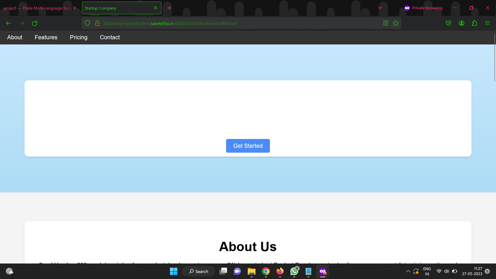
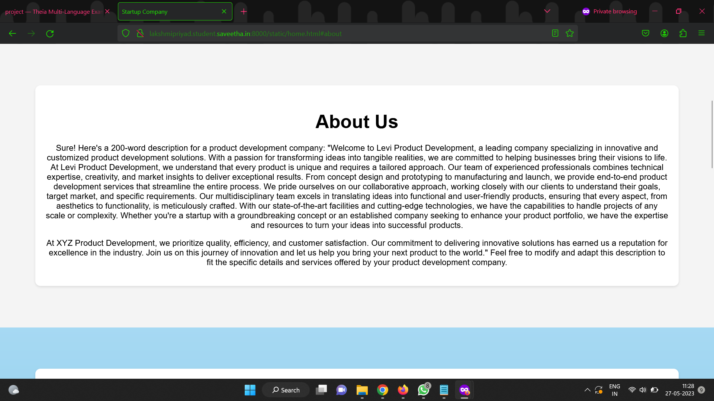
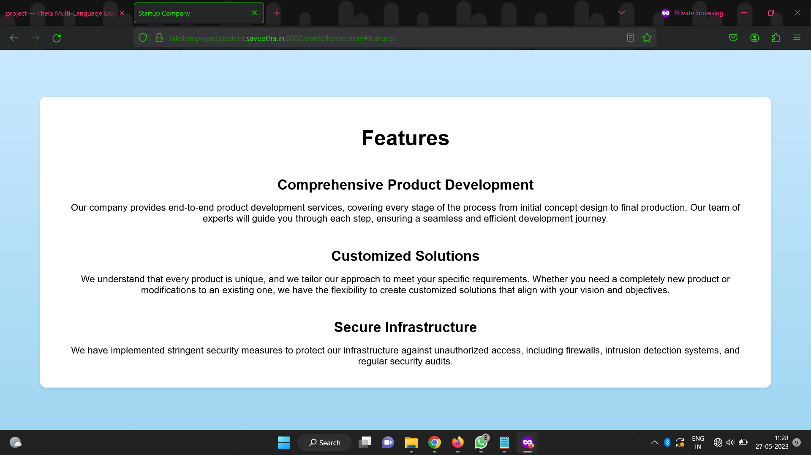
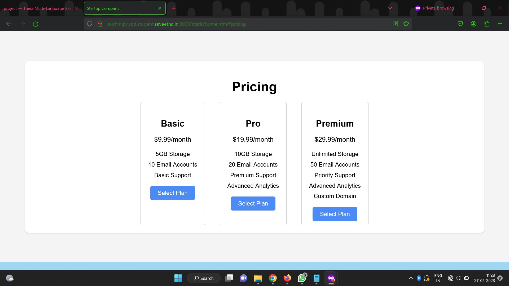
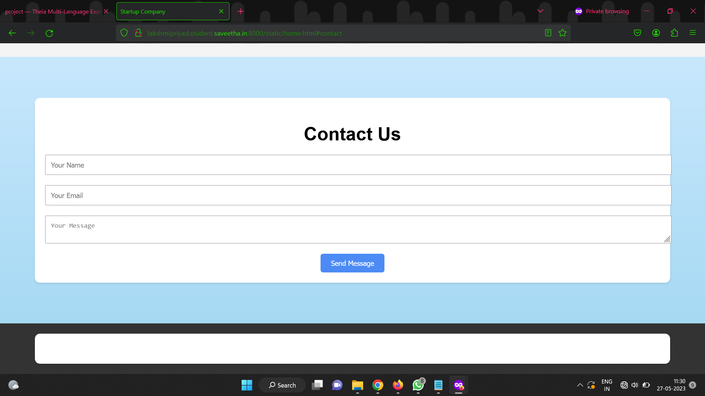

# Web Design for a Software Product Company

## AIM:

To design a static website for a software product company company.

## DESIGN STEPS:

### Step 1:

Requirement collection.

### Step 2:

Creating the layout using HTML and CSS.

### Step 3:

Updating the sample content.

### Step 4:

Choose the appropriate style and color scheme.

### Step 5:

Validate the layout in various browsers.


### Step 6:

Publish the website in the given URL.

## PROGRAM :
```
<!DOCTYPE html>
<html lang="en">
  <head>
    <meta charset="UTF-8" />
    <meta name="viewport" content="width=device-width, initial-scale=1.0" />
    <title>Startup Company</title>
    <link rel="stylesheet" href="css/style.css" />
  </head>

  <body>
    <header>
      <nav>
        <ul>
          <li><a href="#about">About</a></li>
          <li><a href="#features">Features</a></li>
          <li><a href="#pricing">Pricing</a></li>
          <li><a href="#contact">Contact</a></li>
        </ul>
      </nav>
    </header>

    <section id="hero">
      <div class="container">
        <h1>Welcome to levi Company</h1>
        <p>We provide innovative solutions for your business needs.</p>
        <a href="#contact" class="btn">Get Started</a>
      </div>
    </section>

    <section id="about">
      <div class="container">
        <h2>About Us</h2>
        <p>
          Sure! Here's a 200-word description for a product development company:
          "Welcome to Levi Product Development, a leading company specializing in
          innovative and customized product development solutions. With a
          passion for transforming ideas into tangible realities, we are
          committed to helping businesses bring their visions to life. At Levi
          Product Development, we understand that every product is unique and
          requires a tailored approach. Our team of experienced professionals
          combines technical expertise, creativity, and market insights to
          deliver exceptional results. From concept design and prototyping to
          manufacturing and launch, we provide end-to-end product development
          services that streamline the entire process. We pride ourselves on our
          collaborative approach, working closely with our clients to understand
          their goals, target market, and specific requirements. Our
          multidisciplinary team excels in translating ideas into functional and
          user-friendly products, ensuring that every aspect, from aesthetics to
          functionality, is meticulously crafted. With our state-of-the-art
          facilities and cutting-edge technologies, we have the capabilities to
          handle projects of any scale or complexity. Whether you're a startup
          with a groundbreaking concept or an established company seeking to
          enhance your product portfolio, we have the expertise and resources to
          turn your ideas into successful products.
        </p>
        <p>
          At XYZ Product Development, we prioritize quality, efficiency, and
          customer satisfaction. Our commitment to delivering innovative
          solutions has earned us a reputation for excellence in the industry.
          Join us on this journey of innovation and let us help you bring your
          next product to the world." Feel free to modify and adapt this
          description to fit the specific details and services offered by your
          product development company.
        </p>
      </div>
    </section>

    <section id="features">
      <div class="container">
        <h2>Features</h2>
        <div class="feature">
          <i class="fas fa-rocket"></i>
          <h3>Comprehensive Product Development</h3>
          <p>
            Our company provides end-to-end product development services,
            covering every stage of the process from initial concept design to
            final production. Our team of experts will guide you through each
            step, ensuring a seamless and efficient development journey.
          </p>
        </div>
        <div class="feature">
          <i class="fas fa-cogs"></i>
          <h3>Customized Solutions</h3>
          <p>
            We understand that every product is unique, and we tailor our
            approach to meet your specific requirements. Whether you need a
            completely new product or modifications to an existing one, we have
            the flexibility to create customized solutions that align with your
            vision and objectives.
          </p>
        </div>
        <div class="feature">
          <i class="fas fa-shield-alt"></i>
          <h3>Secure Infrastructure</h3>
          <p>
            We have implemented stringent security measures to protect our
            infrastructure against unauthorized access, including firewalls,
            intrusion detection systems, and regular security audits.
          </p>
        </div>
      </div>
    </section>
    <section id="pricing">
      <div class="container">
        <h2>Pricing</h2>
        <div class="pricing">
          <div class="plan">
            <h3>Basic</h3>
            <p>$9.99/month</p>
            <ul>
              <li>5GB Storage</li>
              <li>10 Email Accounts</li>
              <li>Basic Support</li>
            </ul>
            <a href="#" class="btn">Select Plan</a>
          </div>
          <div class="plan">
            <h3>Pro</h3>
            <p>$19.99/month</p>
            <ul>
              <li>10GB Storage</li>
              <li>20 Email Accounts</li>
              <li>Premium Support</li>
              <li>Advanced Analytics</li>
            </ul>
            <a href="#" class="btn">Select Plan</a>
          </div>
          <div class="plan">
            <h3>Premium</h3>
            <p>$29.99/month</p>
            <ul>
              <li>Unlimited Storage</li>
              <li>50 Email Accounts</li>
              <li>Priority Support</li>
              <li>Advanced Analytics</li>
              <li>Custom Domain</li>
            </ul>
            <a href="#" class="btn">Select Plan</a>
          </div>
        </div>
      </div>
    </section>

    <section id="contact">
      <div class="container">
        <h2>Contact Us</h2>
        <form action="#" method="POST">
          <input type="text" name="name" placeholder="Your Name" required />
          <input type="email" name="email" placeholder="Your Email" required />
          <textarea
            name="message"
            placeholder="Your Message"
            required
          ></textarea>
          <button type="submit" class="btn">Send Message</button>
        </form>
      </div>
    </section>

    <footer>
      <div class="container">
        <p>&copy; 2023 Startup Company. All rights reserved.</p>
      </div>
    </footer>

    <script
      src="https://kit.fontawesome.com/your-font-awesome-kit.js"
      crossorigin="anonymous"
    ></script>
  </body>
</html>
```
## OUTPUT:

### Home Page:


## img2 page

## img3 page

## img4 page

## img5 page

## Result:

Thus a website is designed for the software product company and the HTML,CSS code are validated.
